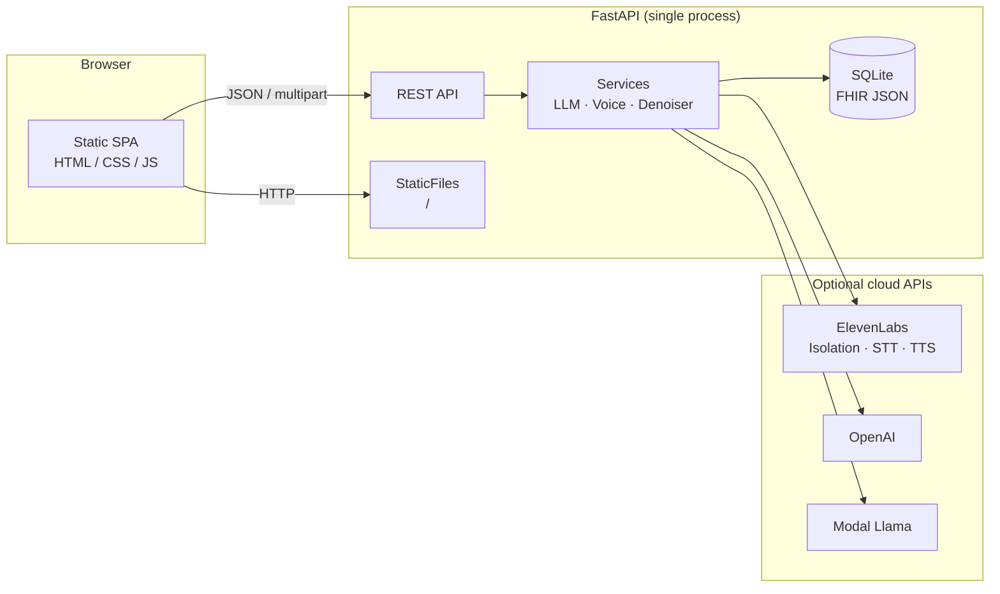
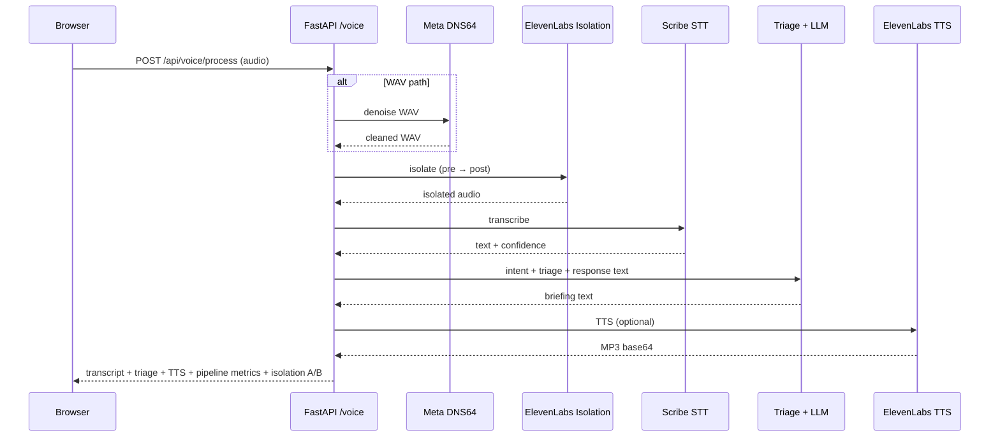
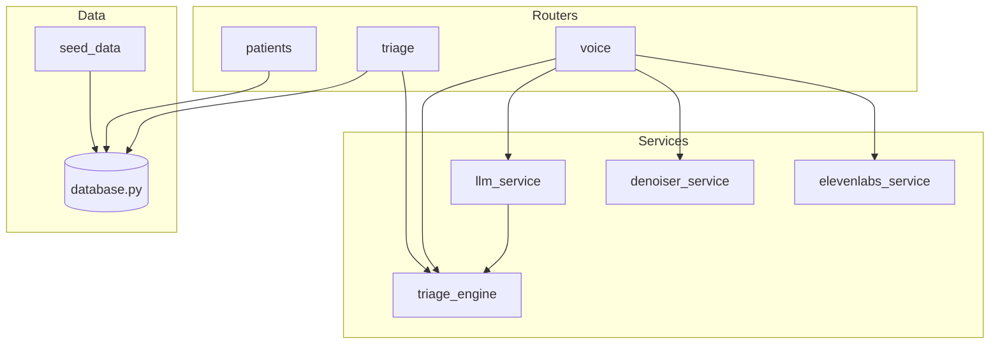

# Project Hail Mary — Combat Medic FHIR Assistant

Field-oriented triage terminal: **FHIR R4** soldier records, **TCCC/MARCH** prioritization, **voice capture** with noise suppression and cloud STT/TTS, optional **LLM** narrative mode (OpenAI or Modal-hosted Llama), and **scenario-based** mass-casualty drills.

---

## Features

| Area | Capability |
|------|------------|
| **Data** | SQLite-backed FHIR JSON resources; seeded roster; patient vitals, allergies, conditions, meds |
| **Triage** | Injury keyword + fuzzy matching; category scoring; MARCH routing; prioritized queue |
| **Voice** | Browser PTT → optional **Meta DNS64** denoiser (WAV path) → **ElevenLabs Audio Isolation** → **Scribe v2** STT with language + word-level confidence |
| **Audio UX** | TTS briefing (Flash v2.5); **pre/post isolation** A/B playback; pipeline confidence strip (denoiser + isolation + STT metrics) |
| **Text** | Parallel text channel bypassing microphone |
| **AI modes** | **Rules**: deterministic TCCC templates · **AI**: GPT-4o or Modal Llama when configured |
| **UI** | Single-page tactical console; triage queue; patient detail with live vitals trace; scenario loaders |
| **Ops** | **Docker** image + Compose stack |

---

## Configuration

Copy **`.env.example`** to **`.env`** for API keys and options. The `.env` file is listed in `.gitignore` — do not commit secrets.

---

## Quick start (local)

```bash
pip install -r requirements.txt
cp .env.example .env
# Edit .env — at minimum set keys for features you need (see table below)

python -m backend.main
```

Open **http://localhost:8000** — FastAPI serves the **static frontend** and **REST API** from one process.

---

## Docker (recommended for demos)

**Prerequisites:** [Docker](https://docs.docker.com/get-docker/) with **Compose v2** (`docker compose`).

```bash
git clone <repo-url> && cd project-hail-mary
cp .env.example .env
# Edit .env with your keys

docker compose up --build
# UI + API: http://localhost:8000
```

Or use the helper (creates `.env` from `.env.example` if missing):

```bash
./scripts/docker-up.sh
```

- **Host port:** set `HOST_PORT=9000` (for example) when running Compose to map `9000 → 8000` in the container.
- **Data persistence:** `docker-compose.yml` mounts a named volume on **`/app/data`** for the SQLite DB.
- **First image build** may take several minutes (PyTorch + native deps).

---

## Architecture

### High-level system context



### Voice processing sequence



### Backend modules (logical)



---

## HTTP API (overview)

| Method | Path | Purpose |
|--------|------|---------|
| GET | `/api/mode` | Rules/AI mode, feature flags |
| POST | `/api/mode` | Toggle mode / isolation |
| GET | `/api/patients` | Roster list |
| GET | `/api/patients/{id}` | Patient detail |
| POST | `/api/triage` | Batch triage from scenario/casualty list |
| POST | `/api/voice/process` | Full voice pipeline |
| POST | `/api/voice/text` | Text-only same intent path |
| GET | `/api/scenarios` | Demo scenario JSON |

Static assets are served from `/` (SPA shell loads `frontend/`).

---

## Environment variables

Copy **`.env.example`** to **`.env`**. Common variables:

| Variable | Role |
|----------|------|
| `ELEVENLABS_API_KEY` | STT, TTS, Audio Isolation (voice pipeline) |
| `ELEVENLABS_ISOLATION` | `on` / `off` — isolation before STT (default on) |
| `OPENAI_API_KEY` | GPT-4o when `LLM_BACKEND=openai` |
| `LLM_BACKEND` | `openai` or `modal` (optional; auto-inferred from env) |
| `MODAL_APP_NAME` | Modal app name for Llama |
| `AI_MODE` | `rules` or `ai` |
| `UNIT_NAME` | Shown in header |
| `PORT` | Listen port inside Docker / `uvicorn` command (default `8000`) |
| `VOICE_COMPARE_MAX_BYTES` | Cap for pre/post isolation audio in JSON responses |

Modal auth uses the standard **`modal token`** CLI or `MODAL_TOKEN_ID` / `MODAL_TOKEN_SECRET` as documented by Modal — never paste tokens into issues or commits.

---

## Demo scenarios

Bottom bar loads scripted mass-casualty sets; see **`demo/demo_script.md`** for a walkthrough.

---

## Repository layout (short)

```
backend/           FastAPI app, routers, services, SQLite engine
frontend/          Static SPA (no bundler)
demo/              Scenario JSON and scripts
scripts/           docker-up.sh helper
Dockerfile         Production-style image (uvicorn, no dev reload)
docker-compose.yml Single-service stack + data volume
```

---

## License

Add your license here if publishing this repository publicly.
